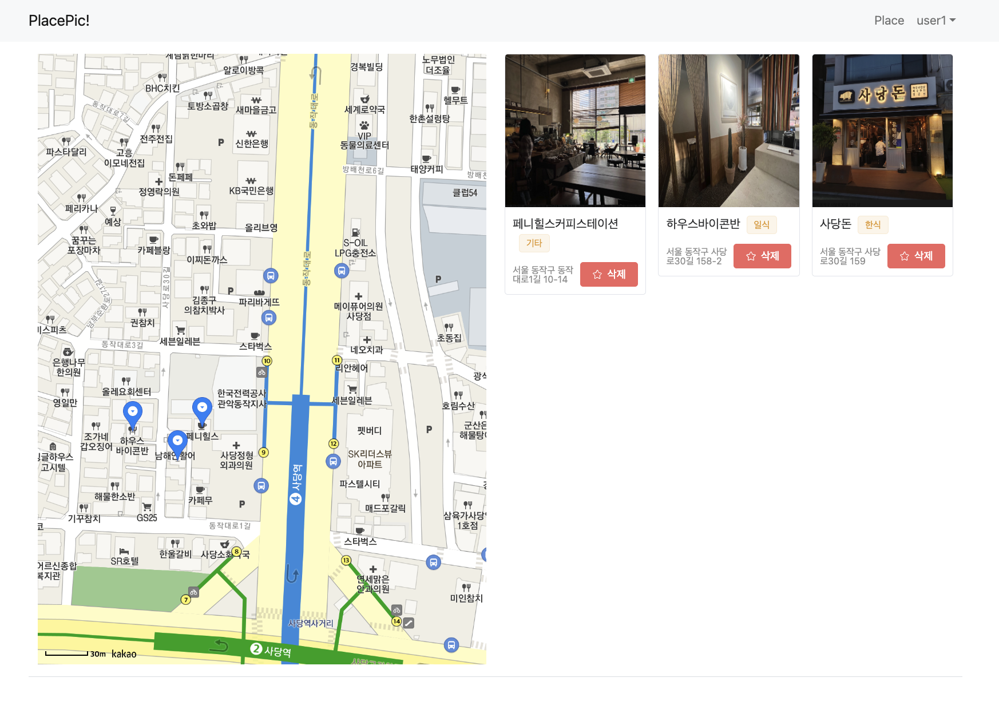
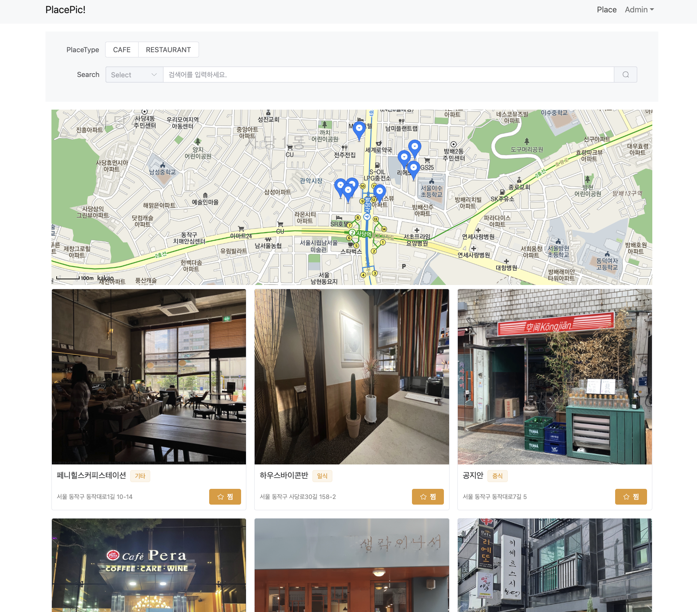
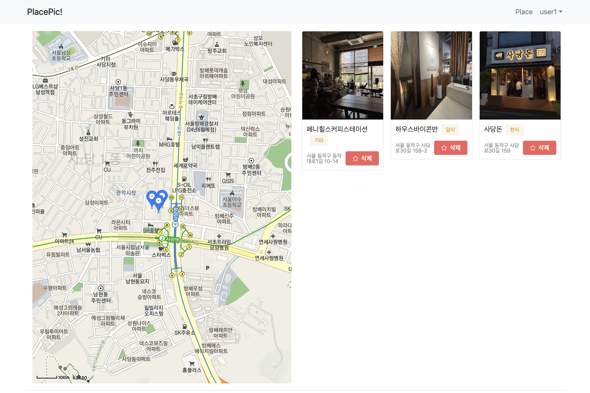
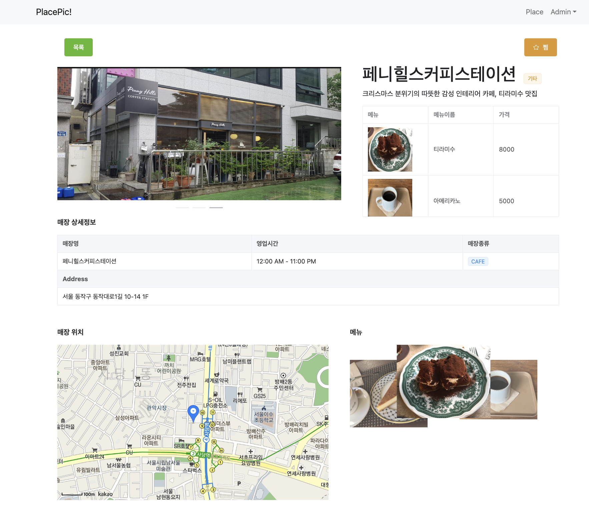
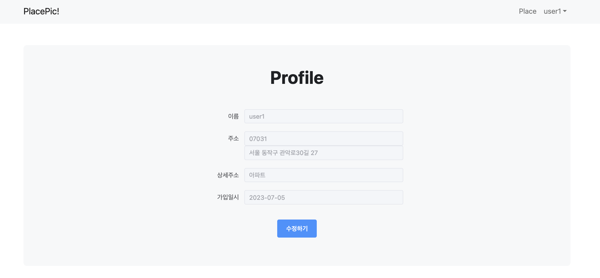
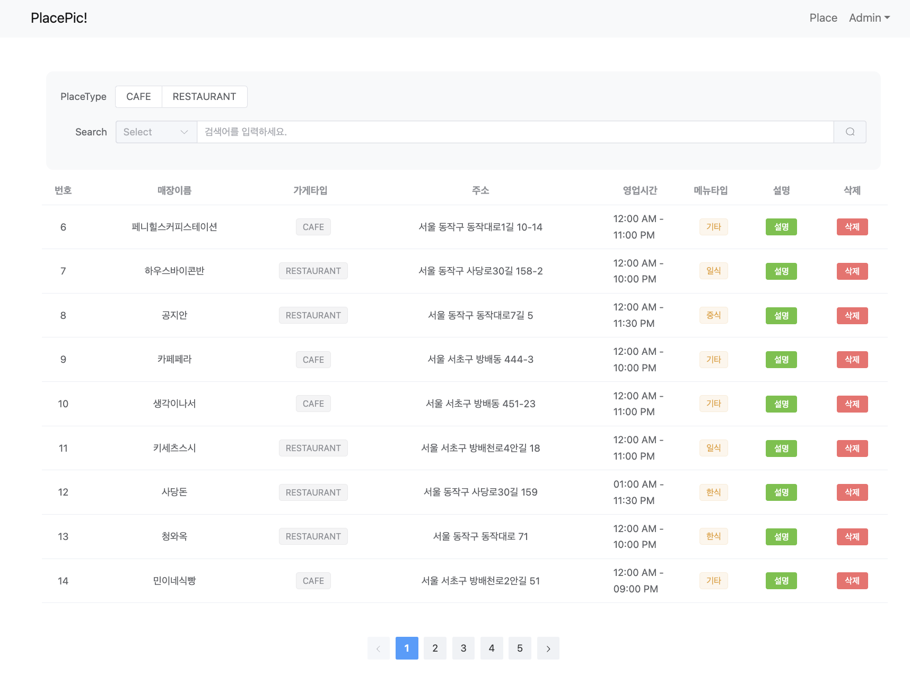
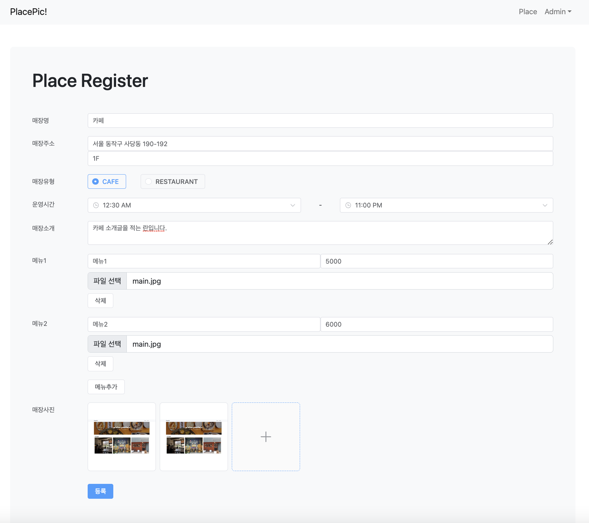

<a name="readme-top"></a>

<!-- PROJECT LOGO -->
<br />
<div align="center">
  <a href="https://github.com/YEASEUL-JANG/Picplace">
    
  </a>

  <h3 align="center">PicPlace</h3>

  <p align="center">
    🍛사당역 주변의 맛집과 카페들을 공유하고 찜(Pick)할 수 있는 홈페이지</p>
</div>

<!-- TABLE OF CONTENTS -->
<details>
  <summary>Table of Contents</summary>
  <ol>
    <li>
      <a href="#about-the-project">About The Project</a>
      <ul>
        <li><a href="#built-with">Built With</a></li>
      </ul>
    </li>
    <li><a href="#getting-started">Getting Started</a></li>
    <li><a href="#담당기능">담당기능</a></li>
    <li><a href="#user-pages">User Pages</a></li>
    <li><a href="#admin-pages">Admin Pages</a></li>
    <li><a href="#contact">Contact</a></li>
  </ol>
</details>
<p></p>


<!-- ABOUT THE PROJECT -->
## About The Project
<p>
💡 'PicPlace' 는 사당역 근처의 맛집들을 소개하는 서비스입니다.
</p>


<br>
<p>
💡 가입한 유저는 원하는 맛집을 검색하여 ‘찜’ 할 수 있고 지도를 통해 찜한 장소들의 위치를 확인할 수 있습니다.
</p>
<p>
<figure>
    
  <figcaption>찜목록 조회</figcaption>
</figure>
</p>
<p align="right">(<a href="#readme-top">back to top</a>)</p>


### Built With

사용된 frameworks,Tools 및 libraries 입니다. 

* ![SpringBoot][SpringBoot]
* ![JAVA][JAVA]
* ![JPA][JPA]
* ![Vue3][Vue3]
* ![JavaScript][JavaScript]
* ![Quartz][Quartz]
* ![Jenkins][Jenkins]
* ![Docker][Docker]
* ![AWS][AWS]
* ![ElementPlus][ElementPlus]

<p align="right">(<a href="#readme-top">back to top</a>)</p>


<!-- GETTING STARTED -->
## Getting Started

1. Clone the repo
   ```sh
   git clone https://github.com/YEASEUL-JANG/Picplace.git
   ```
2. Move to Frontend Folder
   ```sh
   cd frontend
   ```   
3. Install NPM packages
   ```sh
   npm install
   ```
4. Run a application and vue3 page 
   ```sh
   npm run serve
   ```

<p align="right">(<a href="#readme-top">back to top</a>)</p>


<!-- Function -->
## 담당기능

- [x] Spring Security+JWT 를 활용한 토큰 인증방식 로그인 구현
- [x] Quartz Batch를 활용한 주기적인 찜목록 삭제기능 
- [x] DB 구조 설계 (JPA)
- [x] QuaryDSL을 활용한 다중 검색기능
- [x] Kakao Map API 를 활용한 다중 마커 지도 구현 
- [x] Jenkins 와 깃헙을 연동하여 push 시 자동 빌드 구현
- [x] Front,Back,DB 각각의 컨테이너를 연동한 Docker 배포

<p align="right">(<a href="#readme-top">back to top</a>)</p>


<!-- Pages -->
## User Pages

### MainPage
<figure>
    
  <figcaption>카페와 식당 카테고리별 '찜' 많은 베스트 식당 소개</figcaption>
</figure>

### SearchPage
<figure>

<figcaption>지역명, 메뉴명, 가게명, PlaceType 별로 다중 검색기능 포함, Kakao Map API 활용 </figcaption>
</figure>

### LikeListPage
<figure>
    
  <figcaption>'찜' 한 장소들에 대한 목록확인, 추가한 날짜로부터 한달이 지난 데이터는 Quartz Job 에 의해 DB에서 삭제됨</figcaption>
</figure>

### DetailPage
<figure>
    
  <figcaption>장소 상세소개 페이지, Element-Plus 라이브러리를 통한 사진 뷰 기능</figcaption>
</figure>

### ProfilePage
<figure>
    
  <figcaption>수정하기 버튼 클릭 시 input 창이 활성화 됨.</figcaption>
</figure>
    


## Admin Pages

### PlaceListPage
<figure>
    
  <figcaption>element-plus 라이브러리를 활용한 테이블, 툴팁, 페이징, 검색바 등 구현</figcaption>
</figure>

### SearchPage
<figure>

<figcaption>element-plus 라이브러리를 통해 사진업로드를 포함한 폼 등록화면 구현</figcaption>
</figure>

<p align="right">(<a href="#readme-top">back to top</a>)</p>


<!-- CONTACT -->
## Contact

- YouTube Link: [https://youtu.be/Lq1Fb9qqc5Q](https://youtu.be/Lq1Fb9qqc5Q) 
- Project Link: [https://github.com/YEASEUL-JANG/Picplace](https://github.com/YEASEUL-JANG/Picplace)

<p align="right">(<a href="#readme-top">back to top</a>)</p>


<!-- MARKDOWN LINKS & IMAGES -->
[Vue3]: https://img.shields.io/badge/Vue3-20B2AA?style=for-the-badge
[ElementPlus]: https://img.shields.io/badge/ElementPlus-skyblue?style=for-the-badge
[JAVA]: https://img.shields.io/badge/JAVA-orange?style=for-the-badge
[SpringBoot]: https://img.shields.io/badge/SpringBoot-navy?style=for-the-badge
[JPA]: https://img.shields.io/badge/JPA-red?style=for-the-badge
[Quartz]: https://img.shields.io/badge/Quartz-pink?style=for-the-badge
[AWS]: https://img.shields.io/badge/AWS-blue?style=for-the-badge
[Docker]: https://img.shields.io/badge/Docker-Docker?style=for-the-badge
[Jenkins]: https://img.shields.io/badge/Jenkins-purple?style=for-the-badge
[JavaScript]: https://img.shields.io/badge/JavaScript-yellow?style=for-the-badge
